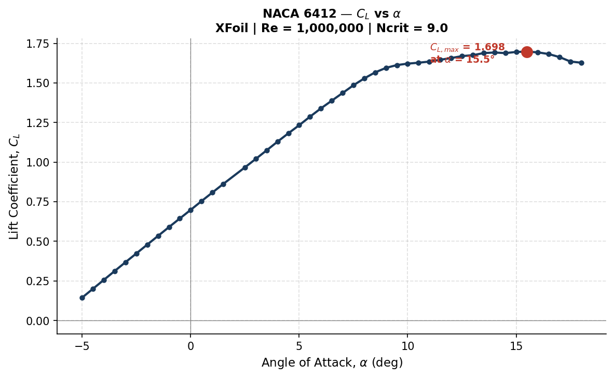
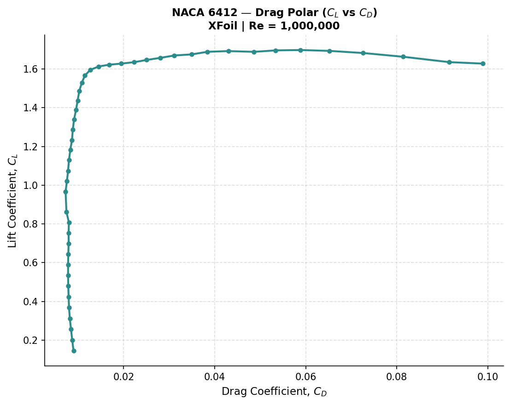
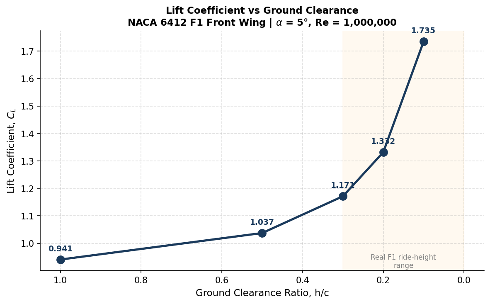
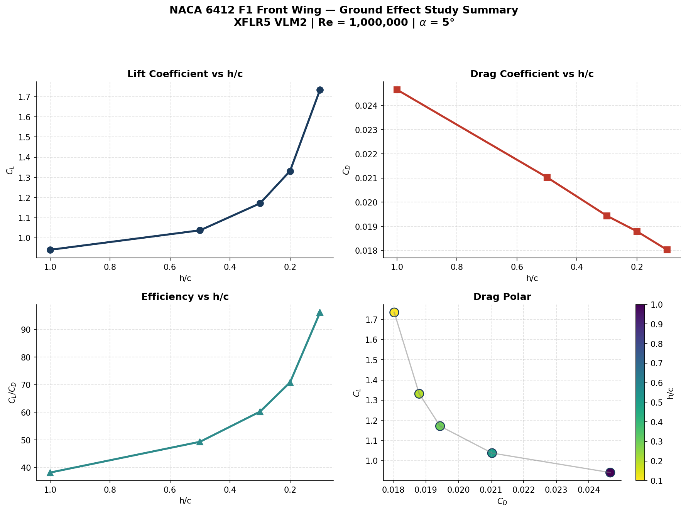

# NACA 6412 F1 Front Wing — Aerodynamic Study


**Part 2 of an aerospace CFD/aerodynamics portfolio series.**
Part 1: [`nosecone-cfd`](https://github.com/Praise1417/nosecone-cfd) — compressible flow CFD study of a Von Kármán nosecone across Mach 0.3 / 0.8 / 1.5 using ANSYS Fluent.

This project continues that series into low-speed, incompressible aerodynamics — moving from a rocket nosecone in ANSYS Fluent to an F1-style front wing element studied in XFLR5. Together, the two projects demonstrate compressible and incompressible flow analysis across two different solver environments (finite-volume CFD and panel/vortex methods), which is intentional: F1 aerodynamics and aerospace vehicle design both draw on this same range of tools.

---

## Summary

A two-part aerodynamic study of the **NACA 6412** aerofoil section, framed as a candidate F1 front wing profile:

1. **2D Direct Foil Analysis** (XFoil, via XFLR5) — full polar characterization of the bare aerofoil section across a wide angle of attack range, establishing baseline lift, drag, and pitching moment behaviour.
2. **3D Wing Ground Effect Study** (VLM2, via XFLR5) — a 3D wing built from the same section, analysed at a fixed angle of attack across five ground clearance ratios (h/c), isolating how proximity to the road surface changes lift and drag — the defining aerodynamic phenomenon behind F1 front wing design.

---

## Module 1 — 2D Direct Foil Analysis

**Tool:** XFoil (Direct Foil Design/Analysis module in XFLR5)
**Polar:** `T1_Re1.000_M0.00_N9.0`
**Conditions:** Re = 1,000,000 | Mach = 0.000 | Ncrit = 9.0 | α = −5° to 18°

### Key Results

| Metric | Value | At α |
|---|---|---|
| C<sub>L,max</sub> | 1.698 | 15.5° |
| C<sub>D,min</sub> | 0.00724 | 2.5° |
| Max C<sub>L</sub>/C<sub>D</sub> | 147.2 | 6.0° |
| Stall onset | ~17° | — |

### Flow Visualisation


*Figure 1: Lift coefficient vs angle of attack, showing a smooth linear region and stall near α = 17°.*


*Figure 2: Classic XFoil drag polar (C<sub>L</sub> vs C<sub>D</sub>), showing the low-drag bucket near α = 0–2°.*

Full set of plots (C<sub>D</sub> vs α, C<sub>L</sub>/C<sub>D</sub> vs α, C<sub>m</sub> vs α, and a combined dashboard) is in [`module1-2d-foil-analysis/plots/`](module1-2d-foil-analysis/plots/).

---

## Module 2 — 3D Wing Ground Effect Study

**Tool:** VLM2 (Vortex Lattice Method), inviscid, via XFLR5 Plane Analysis module
**Plane:** `naca6412_frontwing`
**Conditions:** Re = 1,000,000 | V∞ = 60 m/s | α = 5° (fixed) | h/c swept: 1.0, 0.5, 0.3, 0.2, 0.1

Ground effect was isolated as a pure inviscid/circulation phenomenon — the physical mechanism it is dominated by — while viscous section behaviour is already captured separately in Module 1.

### Key Results

| h/c | C<sub>L</sub> | C<sub>D</sub> | C<sub>L</sub>/C<sub>D</sub> |
|---|---|---|---|
| 1.0 | 0.9409 | 0.0247 | 38.1 |
| 0.5 | 1.0374 | 0.0210 | 49.3 |
| 0.3 | 1.1713 | 0.0194 | 60.3 |
| 0.2 | 1.3316 | 0.0188 | 70.9 |
| 0.1 | 1.7349 | 0.0180 | 96.4 |

As the wing approaches the ground, lift rises and drag falls — a large efficiency gain that accelerates sharply below h/c ≈ 0.3, the regime closest to real F1 ride heights.

### Flow Visualisation


*Figure 3: Lift coefficient rises sharply as ground clearance decreases, with the steepest gain occurring between h/c = 0.2 and 0.1.*


*Figure 4: Combined summary — C<sub>L</sub>, C<sub>D</sub>, efficiency, and drag polar across the full h/c sweep.*

Full set of plots (C<sub>D</sub> vs h/c, dual-axis C<sub>L</sub>/C<sub>D</sub>, drag polar coloured by h/c, percentage change, and sensitivity analysis) is in [`module2-ground-effect-wing/plots/`](module2-ground-effect-wing/plots/).

### A Note on Modelling Limits

VLM2 is an inviscid panel method — it does not model flow separation, viscous wake effects, or 3D vortex interactions with a physical ground boundary layer. The steep C<sub>L</sub> rise at h/c = 0.1 is qualitatively consistent with real ground effect (this is the same physical trend F1 teams exploit), but the absolute magnitude at very low h/c should be treated as indicative rather than a precise prediction, given the limitations of potential-flow theory at small clearances.

---

## Repository Structure

```
naca6412-f1-frontwing-study/
├── module1-2d-foil-analysis/
│   ├── data/
│   │   └── T1_Re1.000_M0.00_N9.0.txt      # Raw XFoil polar export
│   └── plots/                              # 6 analysis graphs
├── module2-ground-effect-wing/
│   ├── data/
│   │   └── groundeffect_hc*.txt            # 5 raw polar exports (one per h/c)
│   └── plots/                              # 8 analysis graphs
├── xflr5-files/
│   └── naca6412_f1wing.xfl                 # Full XFLR5 project file
├── scripts/
│   ├── plot_2d_foil.py                     # Generates Module 1 plots
│   └── plot_ground_effect.py               # Generates Module 2 plots
├── report/                                 # Full technical write-up
├── .gitignore
├── LICENSE
└── README.md
```

---

## Reproducing the Results

1. Open `xflr5-files/naca6412_f1wing.xfl` in XFLR5 v6.62 to inspect the aerofoil, wing geometry, and all stored polars directly.
2. To regenerate the plots from raw data:
   ```bash
   cd scripts
   pip install numpy matplotlib
   python plot_2d_foil.py
   python plot_ground_effect.py
   ```
3. Raw polar data (`.txt`) can be re-imported into XFLR5 or parsed independently for further analysis.

---

## What's Next

This is Part 2 of a 6-month aerospace portfolio series targeting F1 team and space-industry internship applications. Next up:

| Project | Focus |
|---|---|
| CFD Project 2 — F1 Front Wing (ANSYS) | Full 3D CFD validation of ground effect, cross-checked against this VLM study |
| Lap Time Simulator (Python) | Vehicle dynamics using aero data derived from this study |
| CubeSat Subsystem Design | Space-systems track |

---

## Author

**Praise** — 300-level Aerospace Engineering student, Lagos State University (LASU). Founder, AutoMark Systems.

[](https://www.linkedin.com/in/praise-omgbrumaye-923908393/)
[](https://github.com/Praise1417)

---

## References

1. XFLR5 v6.62 — Analysis of foils and wings operating at low Reynolds numbers, Deperrois, A.
2. Drela, M. — *XFOIL: An Analysis and Design System for Low Reynolds Number Airfoils*
3. Katz, J. & Plotkin, A. — *Low-Speed Aerodynamics*, 2nd Ed. (Vortex Lattice Method theory)
4. Zhang, X., Toet, W., Zerihan, J. — *Ground Effect Aerodynamics of Race Cars*, Applied Mechanics Reviews
